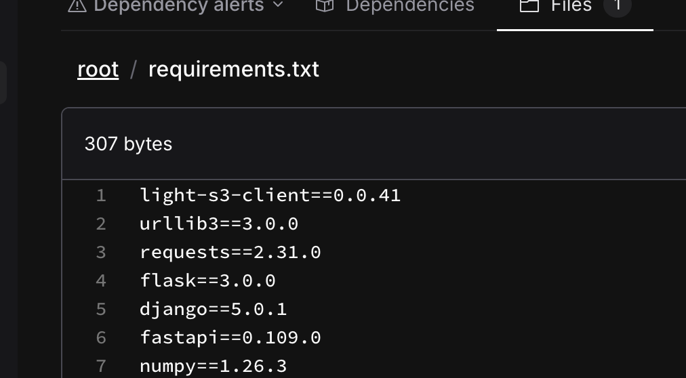
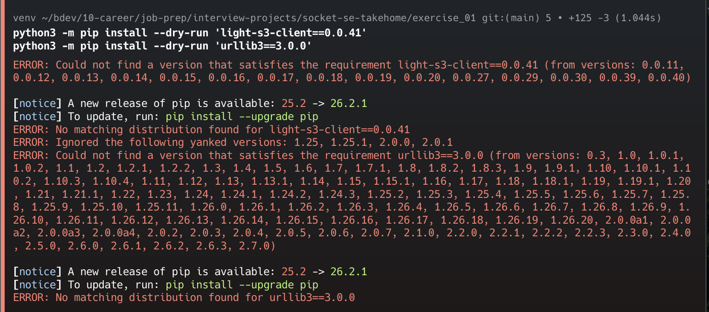

# Exercise 01 — Incorrect Python Dependency Versions

## Customer issue

Socket does not show the requested versions of `light-s3-client` and `urllib3` as expected.

## Reproduction

I created the supplied `requirements.txt` in a small controlled repository and ran a full Socket scan:

```bash
socketcli --repo socket-se-takehome --branch main
```

The scan found one manifest and completed successfully. This confirmed that Socket received the file before I investigated package resolution.

## Investigation

I checked the versions published to PyPI using the native Python package manager:

```bash
python -m pip index versions light-s3-client
python -m pip index versions urllib3
python -m pip install --dry-run 'light-s3-client==0.0.41'
python -m pip install --dry-run 'urllib3==3.0.0'
```

Results:

| Package | Requested | Latest published | Native resolution |
|---|---:|---:|---|
| `light-s3-client` | `0.0.41` | `0.0.40` | No matching distribution |
| `urllib3` | `3.0.0` | `2.7.0` | No matching distribution |

## Finding

The requested package versions are not published in PyPI. Pip independently fails to resolve both package/version pairs, so the source of the behavior is the dependency manifest rather than a Socket ingestion failure.

## Resolution

The manifest should be changed to package versions that actually exist in PyPI. At the time of this investigation, the closest published replacements were:

```diff
-light-s3-client==0.0.41
-urllib3==3.0.0
+light-s3-client==0.0.40
+urllib3==2.7.0
```

These versions should not be applied blindly in a production application. I would complete the remediation with this sequence:

1. Confirm the replacement versions are compatible with the application and the rest of its dependency graph.
2. Update the two invalid pins in `requirements.txt`.
3. Generate or update dependency metadata using the customer's normal lockfile workflow.
4. Run the application's automated tests and a clean package installation.
5. Rerun the Socket scan and verify that the declared and resolved package versions agree.

I validated the proposed published versions without installing them:

```bash
python -m pip install --dry-run \
  'light-s3-client==0.0.40' 'urllib3==2.7.0'
```

The dry-run completed without a resolution error. `light-s3-client==0.0.40` was installable, and `urllib3==2.7.0` was already present in the isolated environment.

For this reproduction repository, I preserved the supplied broken manifest so the original customer condition remains available for review. The baseline commit and screenshot show the input, while the investigation above proves the root cause and documents the corrective action.







