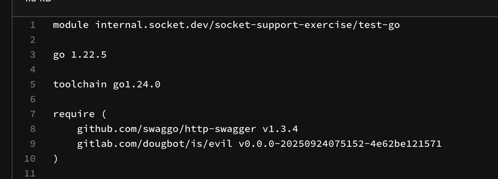
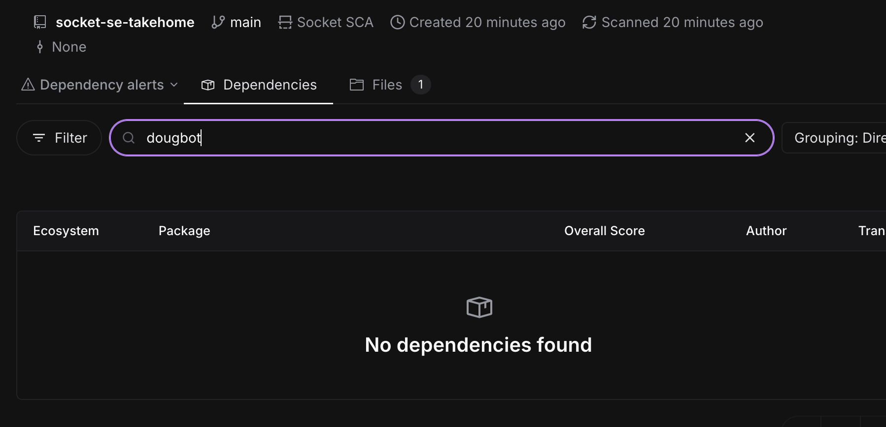
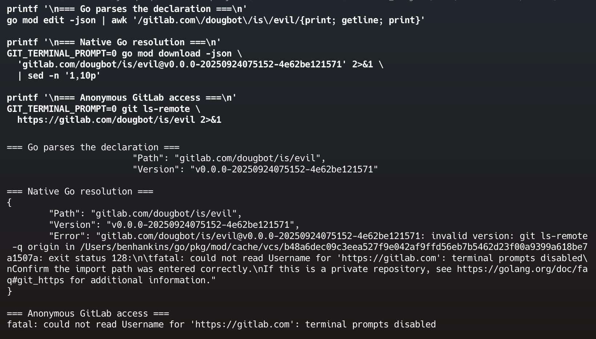

# Exercise 02 — Missing Go Dependency

## Customer issue

The module `gitlab.com/dougbot/is/evil` is declared in `go.mod` but is missing from the Socket dependency results.

## Reproduction

I restored the supplied `go.mod` and ran a full Socket scan:

```bash
socketcli --repo socket-se-takehome --branch main
```

The scan found one manifest and completed successfully.

## Investigation

First, I confirmed that native Go tooling parses the module path and version correctly:

```bash
go mod edit -json
```

Then I tested resolution of only the missing module without changing the supplied manifest:

```bash
GIT_TERMINAL_PROMPT=0 go mod download -json \
  gitlab.com/dougbot/is/evil@v0.0.0-20250924075152-4e62be121571

go env GOPRIVATE

GIT_TERMINAL_PROMPT=0 git ls-remote \
  https://gitlab.com/dougbot/is/evil
```

Go recognized the declaration, but the download and anonymous Git request failed because GitLab required authentication. `GOPRIVATE` was also unset in this environment.

## Finding

The `go.mod` syntax is valid. The dependency cannot be resolved anonymously from its GitLab source, so the environment cannot retrieve the module metadata needed to represent it as a resolved dependency. The primary issue is repository access, not the use of multiple `require` blocks.

## Resolution

1. Confirm that the module path and pseudo-version are correct.
2. Confirm whether the GitLab project is private or otherwise restricted.
3. If it is private, configure a matching `GOPRIVATE` value so Go bypasses the public proxy and checksum database for that module path.
4. Configure appropriately scoped GitLab credentials in the build or CI/CD secret store. `GOPRIVATE` changes module handling but does not provide authentication.
5. Verify that `go mod download` succeeds in the same environment used for scanning.
6. Rerun the Socket scan and confirm that the module appears in Dependencies.

Credentials must not be committed to the repository.

## Evidence






