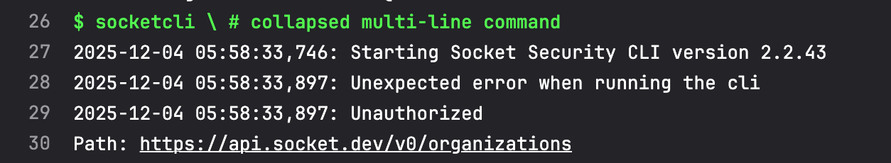
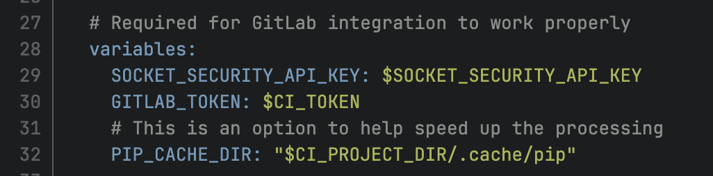

# Exercise 03 — GitLab Pipeline Failure

## Issue

The public GitLab `socket-security` job fails instead of completing a Socket scan.

- [First failed job](https://gitlab.com/socketdev/support-exercises/-/jobs/12317432643)
- [Latest failed job](https://gitlab.com/socketdev/support-exercises/-/jobs/12317451031)

## Finding

The first job failed because the Socket container's default entrypoint treated GitLab's shell bootstrap as CLI arguments. The next commit corrected this with `entrypoint: [""]`.

The latest job starts `socketcli`, but the Socket organizations endpoint returns `Unauthorized` and the job exits with code 3. This confirms that the `SOCKET_SECURITY_API_KEY` available to the job is missing, unavailable, expired, revoked, or otherwise invalid. The public log cannot reveal which condition applies.

The pipeline also maps `GITLAB_TOKEN` from `$CI_TOKEN` instead of the documented `$GITLAB_TOKEN`. This does not cause the current Socket API 401, but it could prevent later GitLab actions such as merge-request comments.

## Resolution

1. Create or rotate a Socket CI/CD token with the required scan permissions.
2. Store it in GitLab under **Settings → CI/CD → Variables** as the masked and hidden variable `SOCKET_SECURITY_API_KEY`.
3. Confirm its protected status and environment scope allow this pipeline to access it.
4. Create a masked and hidden GitLab token named `GITLAB_TOKEN` and correct the mapping.
5. Keep the empty container entrypoint and rerun the pipeline.

```yaml
image:
  name: socketdev/cli:latest
  entrypoint: [""]

variables:
  SOCKET_SECURITY_API_KEY: $SOCKET_SECURITY_API_KEY
  GITLAB_TOKEN: $GITLAB_TOKEN
```

The rerun should no longer return 401, should complete the Socket scan, and should create the expected GitLab feedback. Secret values must never be printed in the job log.

## Evidence





## References

- [Socket for GitLab Pipeline](https://docs.socket.dev/docs/socket-in-your-gitlab-pipeline)
- [Socket CI/CD API-token scopes](https://docs.socket.dev/docs/create-socket-api-key-for-cicd)
