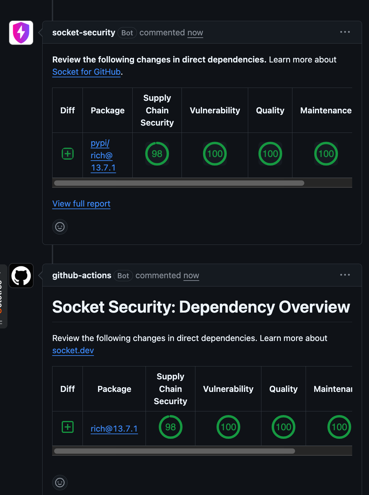

# Exercise 04 — GitHub Actions Integration

## Goal

Run Socket automatically on a GitHub pull request and return the dependency results to the PR.

## Implementation

I stored `SOCKET_SECURITY_API_KEY` as a GitHub Actions repository secret and added `.github/workflows/socket.yml`.

The workflow:

- runs when a pull request is opened or updated;
- grants read-only repository access plus permission to write PR and issue feedback;
- installs `socketsecurity` in an isolated GitHub-hosted runner;
- passes the Socket and GitHub tokens as environment variables; and
- runs `socketcli` against the checked-out repository with the PR number.

The test pull request adds `exercise_04/requirements.txt` containing `rich==13.7.1`, a dependency not already present on the base branch.

## Verification

I opened [pull request #1](https://github.com/WBHankins93/socket-se-takehome/pull/1) and confirmed:

- the `socket-security` Actions job passed;
- Socket's Project Report and Pull Request Alerts checks passed;
- Socket detected `rich@13.7.1` as a new direct dependency; and
- the PR received Socket dependency-overview feedback without exposing the API key.

## References

- [Socket for GitHub Actions](https://docs.socket.dev/docs/socket-for-github-actions)
- [Socket CI/CD API-token scopes](https://docs.socket.dev/docs/create-socket-api-key-for-cicd)

## Evidence

