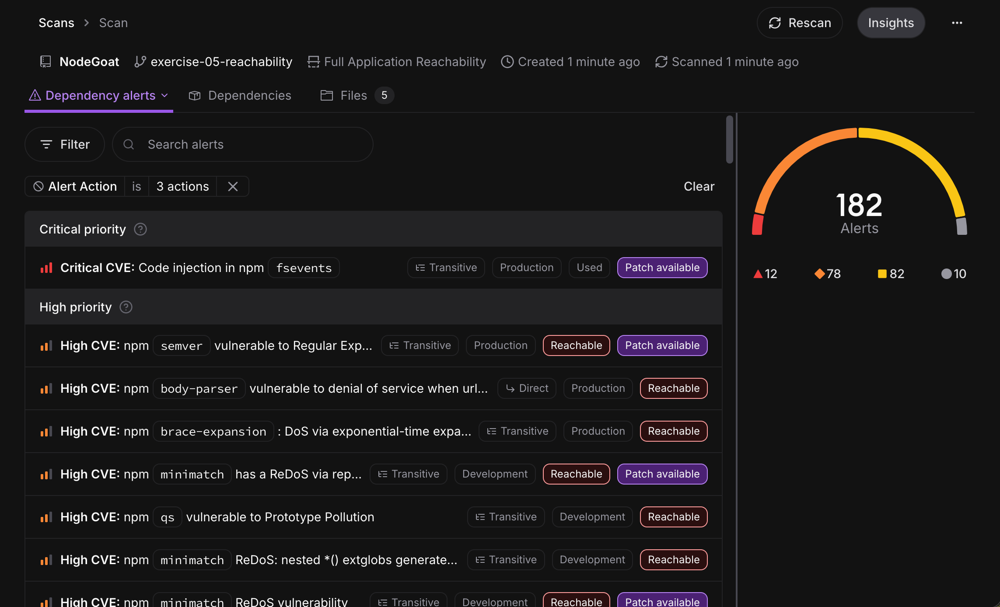

# Exercise 05 — Reachability Analysis

## Goal

Compare Socket's standard dependency scan with Full Application Reachability using OWASP NodeGoat.

## Implementation

I cloned NodeGoat at commit `c5cb68a` and ran both scan modes against the same source and dependency manifests:

```bash
socket scan create --report .
socket scan create --reach --reach-continue-on-install-errors --report .
```

The assignment's Tier 2 terminology is now called **Precomputed Reachability**. Tier 1 is now **Full Application Reachability**.

## Verification

The standard scan identified the dependency and vulnerability inventory using manifest data and precomputed reachability. Full Application Reachability then analyzed application and dependency call paths locally.

The full analysis processed 184 vulnerabilities. It marked 50 as unreachable at the import-analysis stage and deeply analyzed 126, identifying 30 as reachable and 51 as unreachable for 40% noise reduction. The dashboard then labeled findings such as `semver`, `body-parser`, and `brace-expansion` as reachable.

NodeGoat's unavailable development-only `grunt-if` dependency could not be installed. I used Socket's documented continuation flag, so affected findings fell back to precomputed reachability while the remaining application analysis completed.

- [Standard scan](https://socket.dev/dashboard/org/benhankins-takehome/sbom/c4786e8d-7bb5-49a7-acd0-e35ac215a252)
- [Full Application Reachability scan](https://socket.dev/dashboard/org/benhankins-takehome/sbom/008a4405-3a88-46e4-a70c-f3706b82eec4)

## Evidence



## References

- [Full Application Reachability](https://docs.socket.dev/docs/full-application-reachability)
- [Socket scan command](https://docs.socket.dev/docs/socket-scan)
